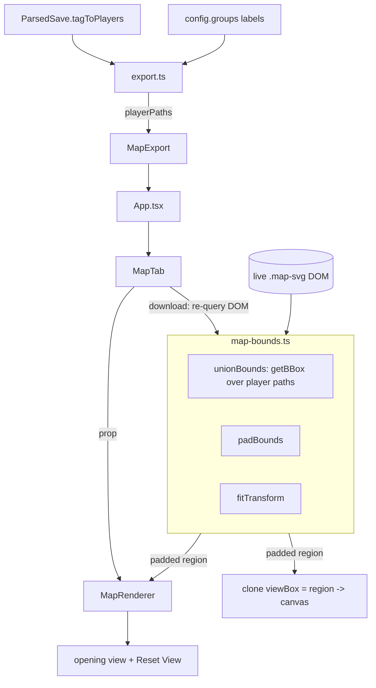

# feat: Open the map fitted to player territory

## Summary

Compute the bounding box of the player countries' territory from the rendered SVG, and use it as the map's opening view instead of the whole world. The same fitted region becomes what "Reset View" returns to, and what the downloaded PNG crops to, so the screen and the image agree. The exported MapChart JSON is deliberately left untouched.

---

## Problem Frame

The map opens at `IDENTITY_TRANSFORM` — scale 1, no offset — which frames the entire 1200×680 world. In a multiplayer save where the players hold a handful of European provinces, the thing the user actually cares about is a small fraction of the frame, and every session starts with the same manual pan-and-zoom. The downloaded PNG has the same problem and no way to fix it: it always renders the full viewBox regardless of what is on screen.

---

## Requirements

- R1. The map opens framed on the combined territory of the player countries, with a margin.
- R2. "Reset View" returns to that fitted view rather than the whole world.
- R3. The downloaded PNG crops to the same fitted region, always — independent of how the user has panned or zoomed.
- R4. A save with no player countries opens on the whole map, exactly as today.
- R5. The exported MapChart JSON is byte-identical to today — `zoomLevel`, `zoomX` and `zoomY` keep their current default values.
- R6. The fit respects the existing zoom clamp, so a single-province player does not blow past the maximum zoom.

---

## Scope Boundaries

- Writing zoom into the MapChart config (R5) — MapChart has `zoomLevel`/`zoomX`/`zoomY` for this, and using them was considered and explicitly rejected.
- Making the PNG follow the current on-screen view — considered and rejected in favour of a stable, reproducible crop.
- Re-fitting on window resize, or any automatic re-fit after the user has panned.
- Any change to how territory is coloured, counted, or outlined.
- A UI control for the margin, or a per-player "fit to this country" action.

### Deferred to Follow-Up Work

- `src/lib/hand-drawn.ts` does not exist on `main` (it lives on the `map-filters` branch). When that export lands on this baseline it will need the same crop treatment, or an explicit decision that it stays full-map.

---

## Context & Research

### The baseline

**Target branch: `main`.** `feat/subject-hatching` is 8 commits ahead with wasteland-fill work that PR #16 did not capture (the PR merged the branch at `6d62aca`, before those commits). This plan targets `main` as-is by explicit choice.

That has one consequence worth stating plainly. `main` carries a location-attribution bug: the gamestate's location database is keyed 1..N while `locationNames` is built 0-based, in both `src/lib/binary/sections/metadata.ts` and `src/lib/save-parser.ts`. Every owned location is therefore attributed to the name one position ahead. Measured on `MP_BOH_1644`, 401 of 19,239 owned locations resolve to shapeless lakes and sea zones and are dropped; on `MP_SCO_1453`, 275 of 13,812.

For *this* feature the visual impact is small — a one-position shift lands on a neighbouring location, so a bounding box over thousands of them moves very little — but the fitted region is computed from territory that is not quite the player's. The fix is a two-line change already committed on `feat/subject-hatching` (`f2986ce`). Landing it first would make this feature exactly right rather than approximately right.

### How the view works today

- `src/components/MapRenderer.tsx` holds `transform` state (`Transform` = `{x, y, scale}`), initialised to `IDENTITY_TRANSFORM`. `handleReset` sets it back to identity.
- `.map-transform` (in `src/App.css`) applies `translate(x,y) scale(s)` with `transformOrigin: 0 0`, inside `.map-viewport` which is `100%` wide, `70vh` tall, `overflow: hidden`, `position: relative`.
- `.map-svg` is `width: 100%; height: auto`, so at scale 1 the SVG's CSS width equals the viewport's content width. That makes the unit conversion `pixelsPerUnit = container.clientWidth / viewBoxWidth`, independent of the current transform — which matters, because measuring the SVG's own bounding rect would fold the live transform back into the calculation.
- `src/lib/map-styles.ts` already holds the transform vocabulary: `Transform`, `IDENTITY_TRANSFORM`, `clampScale` (0.5–20), `zoomTowardCursor`, `panTransform`, `transformCss`, `parseViewBox`, `getMapDimensions`.

### How the PNG download works today

`handleDownloadMap` in `src/components/MapTab.tsx` clones the live `.map-svg`, sets the clone's `width`/`height` to the full viewBox dimensions, serialises it to a blob, loads it as an `Image`, and draws it at the origin. `computeDownloadLayout` sizes the canvas from those dimensions plus a 300px legend panel.

The important consequence: **the PNG already ignores the on-screen transform**, which is why R3's "always the fitted region" is a small change rather than a rewrite. Setting the clone's `viewBox` to the fitted region crops it natively and keeps the output vector-sharp, with no canvas-level clipping.

### Identifying player territory

`tagToPlayers` lives on `ParsedSave` and is consumed in `src/lib/export.ts`, which already knows which groups belong to players (`buildTagLabel` produces `"TAG - Alice"`) and which are vassal overlays (`"TAG - subjects"`, detected by `isSubjectEntry`). `MapExport` is the established channel for paint-time data the renderer needs alongside an untouched `MapChartConfig` — `subjectOverlords` uses exactly this pattern.

### Institutional learnings

`docs/solutions/` does not exist in this repo. The governing constraints are CLAUDE.md, of which three bear directly on this work:

- "`handleDownloadMap` reads from the rendered DOM SVG, so color overrides are automatically included." The download deliberately re-queries the DOM rather than receiving state from the renderer. This plan follows that: `MapTab` computes the bounds from its own DOM query at download time rather than receiving them through a callback.
- "Vitest runs with `globals: false`, so RTL auto-cleanup does NOT register."
- "Prefer extracting testable pure helpers over inline logic in components."

---

## Key Technical Decisions

- **Measure geometry with `getBBox()` on the live paths, not a precomputed asset**: The SVG is already parsed and in the DOM, and only player paths need measuring. A committed bbox asset would be another ~500 KB for something derivable at runtime in milliseconds.
- **`getBBox()` is read defensively**: it is unimplemented in jsdom and throws there, and the repo's tests run in jsdom. A path that cannot be measured is skipped rather than failing the fit, which also keeps the "no exceptions" convention intact at the module boundary.
- **Unit conversion from `container.clientWidth`, not the SVG's bounding rect**: the SVG sits inside the transformed wrapper, so its measured rect already includes the live scale. Deriving from the container keeps the fit idempotent — fitting twice gives the same answer.
- **One padded region feeds both consumers**: the on-screen transform and the PNG crop are computed from the same padded bounds, so the image matches the screen by construction rather than by two calculations happening to agree.
- **The PNG crops via the clone's `viewBox`, not the canvas**: native SVG cropping stays vector-sharp and needs no clipping maths; `computeDownloadLayout` then receives the cropped dimensions in place of the full ones.
- **`MapTab` recomputes bounds at download time from its own DOM query**: follows the established download-reads-the-DOM pattern rather than introducing a callback to lift bounds out of `MapRenderer`. The duplicate work is a few milliseconds on a user-initiated action.
- **Player paths are resolved in `src/lib/export.ts` and ride on `MapExport`**: that is where `tagToPlayers` and the group labels already meet, and it mirrors `subjectOverlords` exactly. `MapChartConfig` stays untouched (R5).
- **The fit applies once per load, not on every recolor**: style changes, colour overrides and outline-width drags all re-run the recolor effect. Re-fitting on those would yank the view out from under a user who had panned.

---

## Open Questions

### Resolved during planning

- *Does the PNG currently follow the on-screen view?* No — it renders the full viewBox from a clone, which is why the crop is a contained change.
- *Where does player identity come from?* `tagToPlayers` on `ParsedSave`, already resolved into labelled groups inside `export.ts`.
- *Is a precomputed geometry asset needed?* No — `getBBox()` on the player paths is enough, and avoids a large committed asset.
- *Does the hand-drawn export need the same treatment?* Not on this baseline; `src/lib/hand-drawn.ts` is not on `main`.

### Deferred to implementation

- The exact margin factor. Something near 10% of the fitted extent is the starting point, but it wants to be eyeballed against a real save — a sprawling empire and a one-province minor frame very differently at the same percentage.
- Whether a very small fitted region needs the PNG's `renderScale` raised so a one-province player still exports a usefully large image, rather than a tiny one. Depends on what the cropped canvas actually measures.
- Whether the initial fit should wait for fonts/layout beyond the existing `ready` signal. The recolor effect's current ordering may already be sufficient.

---

## High-Level Technical Design

> *This illustrates the intended approach and is directional guidance for review, not implementation specification. The implementing agent should treat it as context, not code to reproduce.*



The shape of the two consumers:

```
region = padBounds(unionBounds(playerPathElements), margin)

on screen:  fitTransform(region, viewBoxDims, containerWidth, viewportDims) -> Transform
PNG:        clone.viewBox = region;  computeDownloadLayout({w,h} = region, ...)

no region (no players, nothing measurable) -> identity transform / full viewBox
```

---

## Implementation Units

- U1. **Bounds and fit maths**

**Goal:** Turn a set of player path elements into a padded region, and a region into a `Transform`.

**Requirements:** R1, R4, R6

**Dependencies:** None

**Files:**
- Create: `src/lib/map-bounds.ts`
- Create: `src/lib/__tests__/map-bounds.test.ts`

**Approach:**
- A `Bounds` shape (`x`, `y`, `width`, `height`) in viewBox user units, with an explicit "no bounds" sentinel rather than null, following the repo's sentinel convention.
- `unionBounds` walks path elements and unions their `getBBox()` results. Each call is wrapped so an element that cannot be measured is skipped — jsdom does not implement `getBBox`, and a degenerate path can legitimately have none. Zero measurable paths yields the sentinel.
- `padBounds` grows a region by a margin factor and clamps it to the viewBox, so a player hugging the map edge does not produce a region extending into nothing.
- `fitTransform` converts the region to pixels via `pixelsPerUnit = containerWidth / viewBoxWidth`, picks `scale` as the smaller of the two axis ratios, runs it through the existing `clampScale`, and centres the region in the viewport. It returns `IDENTITY_TRANSFORM` for the sentinel region or a zero-sized viewport.
- Pure arrow consts, `const` bindings, `else` on every `if`, no throws — matching `src/lib/map-styles.ts`.

**Execution note:** Write `fitTransform` test-first. It is pure arithmetic with several degenerate inputs, and the failure mode — a view that is subtly off-centre or over-zoomed — is far easier to pin with a test than to eyeball.

**Patterns to follow:**
- `src/lib/map-styles.ts` — `Transform`, `clampScale`, `zoomTowardCursor` for the transform vocabulary and docblock style.
- `src/lib/location-resolve.ts` — sentinel-instead-of-null discipline.

**Test scenarios:**
- Happy path: two disjoint boxes union to the region spanning both.
- Happy path: a single box unions to itself.
- Happy path: `fitTransform` on a region half the viewBox width, in a viewport matching the map aspect, yields roughly double scale and centres the region.
- Happy path: `padBounds` with a 10% margin grows a centred region on all four sides.
- Edge case: `unionBounds` over an empty list returns the sentinel.
- Edge case: `unionBounds` skips elements whose `getBBox` throws, and still unions the rest.
- Edge case: `unionBounds` returns the sentinel when every element throws — the jsdom case.
- Edge case: a nested box entirely inside another does not change the union.
- Edge case: `padBounds` on a region at the map's edge clamps to the viewBox instead of extending past it.
- Edge case: `padBounds` on a zero-width region still produces a usable region rather than collapsing.
- Edge case: `fitTransform` on the sentinel region returns `IDENTITY_TRANSFORM`.
- Edge case: `fitTransform` with a zero-width container returns `IDENTITY_TRANSFORM` rather than dividing by zero.
- Edge case: a one-province region clamps at the 20× ceiling rather than exceeding it (R6).
- Edge case: a region spanning the whole map clamps at the 0.5× floor.
- Edge case: a region wider than it is tall is fitted on the width axis, and the reverse on height.

**Verification:**
- Fitting a region, then fitting the same region again from the resulting state, produces the same transform — the calculation does not fold in its own output.

---

- U2. **Carry player paths through the export**

**Goal:** Make the set of player-owned path ids available to the view layer.

**Requirements:** R1, R4

**Dependencies:** None

**Files:**
- Modify: `src/lib/export.ts`
- Modify: `src/lib/types.ts`
- Modify: `src/App.tsx`
- Modify: `src/components/MapTab.tsx`
- Test: `src/lib/__tests__/export.test.ts`

**Approach:**
- Add `playerPaths` to `MapExport` beside `subjectOverlords`, documented the same way — view-time only, no group changes. `MapChartConfig` is untouched (R5).
- Collect the canonical path ids belonging to player tags, including their vassal overlay groups, so a player's subject territory is inside the frame rather than hanging off the edge of it.
- Empty when the save has no players, which is what drives R4's whole-map fallback downstream.
- Thread it App → MapTab → MapRenderer as a prop, alongside the existing `subjectOverlords`.

**Patterns to follow:**
- `src/lib/export.ts` — how `subjectOverlords` is assembled and returned beside `config`.
- `src/lib/types.ts` — the `MapExport` docblock explaining why view-time data rides outside the config.

**Test scenarios:**
- Happy path: a save with one player yields that player's resolved path ids.
- Happy path: a save with two players yields both players' paths.
- Happy path: a player's vassal overlay paths are included.
- Edge case: a save with no players yields an empty list.
- Edge case: a non-player country's paths are excluded even with `playersOnly` off.
- Edge case: with `playersOnly` on, the result matches the paths actually painted.
- Edge case: names with no shape on the map are absent, so every returned id is measurable.
- Integration: `config` is deep-equal with and without this addition — no group, path, or count moves (R5).

**Verification:**
- The exported MapChart JSON is byte-identical to the pre-change output for the same save.

---

- U3. **Open on the fitted view, and reset to it**

**Goal:** Frame the map on player territory when a save loads, and make "Reset View" return there.

**Requirements:** R1, R2, R4, R6

**Dependencies:** U1, U2

**Files:**
- Modify: `src/components/MapRenderer.tsx`
- Test: `src/components/__tests__/MapRenderer.test.tsx`

**Approach:**
- Once the document is ready, resolve the player path ids against the existing `pathMapRef`, compute the padded region, and set the transform from it.
- Hold the fitted transform in a ref so `handleReset` returns to it rather than to `IDENTITY_TRANSFORM` (R2). With no fitted view, reset keeps today's behaviour.
- Fit in its own effect keyed on readiness and the player paths — *not* in the recolor effect, which re-runs on every style change, colour override and outline-width drag. Re-fitting there would fight the user's panning.
- Fall back to `IDENTITY_TRANSFORM` whenever there is no region: no players, no measurable paths, or an unmeasured container (R4).

**Execution note:** In jsdom `getBBox` is unimplemented, so the component tests need it stubbed on the prototype to exercise the fitted path at all, and restored afterwards. A test that omits the stub is exercising the fallback, not the feature — worth asserting both deliberately rather than discovering the distinction later.

**Patterns to follow:**
- `src/components/MapRenderer.tsx` — the existing `ready` gate, `pathMapRef`, and `handleReset`.
- `src/components/__tests__/MapRenderer.test.tsx` — `waitForMapReady`, the `mockSvg` fixture, and the explicit `cleanup()` in `afterEach` that `globals: false` makes necessary.

**Test scenarios:**
- Happy path: with stubbed geometry and player paths, the map opens at a scale above 1 and a non-zero offset.
- Happy path: "Reset View" after panning returns to the fitted transform, not to 100% (R2).
- Happy path: the zoom readout reflects the fitted scale rather than always showing 100%.
- Edge case: with no player paths, the map opens at identity and "Reset View" behaves as today (R4).
- Edge case: with player paths naming ids absent from the asset, the fit falls back to identity rather than framing nothing.
- Edge case: when every `getBBox` throws — the unstubbed jsdom case — the map opens at identity and does not error.
- Edge case: a one-province player does not exceed the 20× clamp (R6).
- Edge case: changing style, colour overrides or outline width after the user pans does not re-fit the view.
- Edge case: loading a different save re-fits to the new players.
- Integration: the fit runs after the recolor pass, so the outline layer and fills are intact at the fitted scale — the two effects do not race.

**Verification:**
- Panning away and pressing "Reset View" lands back on exactly the opening frame.

---

- U4. **Crop the downloaded PNG to the fitted region**

**Goal:** Make the exported image show the same region as the opening view.

**Requirements:** R3, R4

**Dependencies:** U1, U2

**Files:**
- Modify: `src/components/MapTab.tsx`
- Modify: `src/lib/map-styles.ts`
- Test: `src/lib/__tests__/map-styles.test.ts`

**Approach:**
- At download time, compute the padded region from the same DOM query `handleDownloadMap` already makes, using U1's helpers — following the established "the download reads the rendered DOM" pattern rather than receiving state from the renderer.
- Set the cloned SVG's `viewBox` to the region and its `width`/`height` to the region's dimensions. Native viewBox cropping keeps the output vector-sharp and needs no canvas clipping.
- Feed the region's dimensions to `computeDownloadLayout` in place of the full map dimensions, so the canvas and the legend panel size to the crop.
- Always the fitted region, never the on-screen transform (R3) — the image is reproducible for a given save regardless of how the user has been navigating.
- With no region, everything falls through to today's full-map behaviour (R4).

**Patterns to follow:**
- `src/components/MapTab.tsx` — the existing clone/serialise/draw sequence and its legend pass.
- `src/lib/map-styles.ts` — `computeDownloadLayout`'s existing shape and its tests.

**Test scenarios:**
- Happy path: `computeDownloadLayout` given a cropped region sizes the canvas to the region plus the legend panel.
- Happy path: a region half the map's width yields a canvas whose map area is half as wide, with the legend panel unchanged.
- Edge case: a very wide, short region still leaves the legend panel a usable height, or the plan's minimum is applied.
- Edge case: a region equal to the full viewBox produces today's layout exactly.
- Edge case: with no players, the layout matches the pre-change output for the same save (R4).
- Edge case: a tiny region does not produce a degenerate canvas — whatever minimum the implementation settles on holds.
- Integration: the downloaded PNG's framing is unchanged by panning or zooming beforehand (R3).

**Verification:**
- For a save with players, the PNG's map area shows the same region as the opening screen, with the legend intact.

---

## System-Wide Impact

- **Interaction graph:** A new effect in `MapRenderer` runs after the existing recolor effect; `handleReset`'s meaning changes; `handleDownloadMap` gains a crop step. No parser or export-format behaviour moves.
- **Error propagation:** Every failure mode degrades to the current behaviour — unmeasurable geometry, an unmeasured container, and an empty player set all fall back to the full-map view rather than erroring.
- **State lifecycle risks:** The fitted transform is remembered for "Reset View", so it has to be cleared or recomputed when a new save loads, or reset would return to the previous save's frame.
- **API surface parity:** `MapExport` gains one field; `MapChartConfig` and the downloaded JSON are unchanged.
- **Integration coverage:** Two things unit tests cannot prove — that the fit effect does not race the recolor effect, and that the PNG's framing is genuinely independent of the on-screen transform.
- **Unchanged invariants:** Legend counts, group membership, the exported MapChart JSON, and every colour decision are untouched. This plan changes only what part of the map is framed.

---

## Risks & Dependencies

| Risk | Mitigation |
|------|------------|
| Player locations are mis-attributed on `main`, so the fitted region is built on slightly wrong territory | Documented above with measured numbers; the one-position shift lands on neighbours so the region moves very little. The fix is `f2986ce` on `feat/subject-hatching` and can be landed first |
| Players scattered across distant continents produce a region spanning the world, making the fit a no-op | Accepted: fitting all player territory is the stated intent. The 0.5× clamp keeps it sane |
| `getBBox` is unimplemented in jsdom, so the fitted path is invisible to tests unless stubbed | Called out in U3's execution note; both the stubbed and unstubbed paths are asserted deliberately |
| The fit fights the user's panning if it re-runs on style or colour changes | Fit lives in its own effect keyed on readiness and player paths, never in the recolor effect; covered by a test |
| A one-province player produces an extreme zoom or a degenerate PNG canvas | The existing `clampScale` bounds the on-screen case; the PNG minimum is an explicit deferred question |
| "Reset View" no longer reaching the whole world surprises users who relied on it | Accepted by decision. A follow-up could add a separate whole-world control if it proves annoying |

---

## Documentation / Operational Notes

- Add to CLAUDE.md's Gotchas: `getBBox()` is unimplemented in jsdom, so any geometry-measuring code needs it stubbed in tests and a fallback in production.
- Add to CLAUDE.md's Conventions: the map's opening view is fitted to player territory and is also what "Reset View" returns to; the PNG crops to the same region while the MapChart JSON deliberately does not carry zoom.
- Note in CLAUDE.md that `.map-svg` is `width: 100%`, so viewBox-to-pixel conversion derives from the container's width — measuring the SVG's own rect folds the live transform back in.

---

## Sources & References

- Related code: `src/components/MapRenderer.tsx`, `src/components/MapTab.tsx`, `src/lib/map-styles.ts`, `src/lib/export.ts`, `src/lib/types.ts`, `src/App.css`
- Related PRs: #16 (merged `feat/subject-hatching` at `6d62aca`, before the 8 wasteland commits)
- Related commit: `f2986ce` on `feat/subject-hatching` — the location-attribution fix discussed under Context
