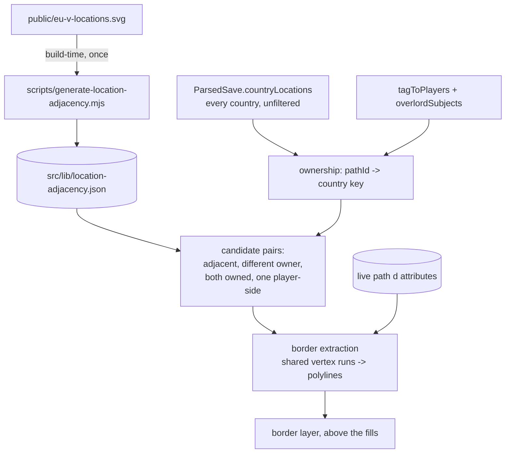

# feat: Outline player borders where they meet another country

## Summary

Draw an outline along the edges where a player's territory meets another country's — another player, an AI, or the player's own subject — and nowhere else. Coastline and borders with unclaimed land stay bare. The shared border between two locations is extracted from the map asset's own geometry at render time, using a committed adjacency graph to narrow the work to the handful of pairs that can produce a border.

---

## Problem Frame

The existing outline (`Outline Width` in the style panel) clones every coloured path and shrinks each fill by 0.995 so the stroke behind peeks through at every edge. That draws a line around every *location*, including the internal edges between two provinces of the same country, so a large empire looks like a mesh rather than a territory. There is no way to see where one country stops and the next begins.

The map asset makes the naive fix unavailable: the paint-over trick that would reveal only a blob's outer boundary can't distinguish a coastline from a land border, because the ocean is the container's background rather than a shape, and unclaimed land is an ordinary path like any other.

---

## Requirements

- R1. An outline is drawn on an edge between two locations when they have different owners and at least one side is player territory.
- R2. No outline on the internal edges within a single country.
- R3. No outline on coastline, or on borders with land nobody owns (uncolonized territory, wastelands).
- R4. A player's subject counts as its own country, so the boundary between an overlord and its subject is outlined.
- R5. Borders between two AI countries are not outlined — this is about player territory.
- R6. The outline is correct with `playersOnly` on, where AI territory is not painted and is absent from `config.groups`.
- R7. The `Outline Width` control now drives this, replacing the per-location outline; width 0 still means no outline.

---

## Scope Boundaries

- Keeping the old per-location outline available — it is replaced (R7), by decision.
- Outlining AI-versus-AI borders (R5).
- Outlining coastline or unclaimed-land edges (R3).
- Any change to fills, hatching, legend counts, or the exported MapChart JSON.
- A separate colour control for borders; the existing `Outline` colour is reused.

### Deferred to Follow-Up Work

- Reconciling the adjacency asset with the one on `feat/subject-hatching`: that branch already generates an identical graph for wasteland fill. Whichever lands second should delete its duplicate rather than shipping two.
- The downloaded PNG. `handleDownloadMap` clones the live `.map-svg`, so the border layer comes along automatically if it is inside that element — worth confirming during implementation, but no deliberate work is planned here.

---

## Context & Research

### The baseline

**Target branch: `main`,** by explicit choice, re-deriving what it needs rather than stacking on open branches. Two consequences worth stating up front.

`feat/fit-zoom-to-players` (pushed, unmerged) already computes player-held path ids as `collectPlayerPaths` in `src/lib/export.ts`. This plan needs the same thing and will implement it again. The two should be reconciled when that branch merges — they answer the same question and should not both survive.

`feat/subject-hatching` (unpushed, unmerged, 8 commits) already contains `scripts/generate-location-adjacency.mjs` and the committed graph this plan calls for in U2, plus the location-attribution fix discussed below. Landing that branch first would make U1 and U2 unnecessary.

`main` also carries the location-attribution off-by-one: the gamestate's location database is keyed 1..N while `locationNames` is built 0-based, so every owned location is attributed to the name one position ahead. Measured on `MP_BOH_1644`, 401 of 19,239 owned locations resolve to shapeless names and are dropped. **This feature is more sensitive to that bug than the previous two were**: a border is drawn from a per-location ownership comparison, so a shifted owner puts a border line along the wrong province edge rather than merely nudging a bounding box. Expect visibly wrong borders in places until it is fixed.

### Why the cheap approach does not work here

The obvious trick for outlining a blob is to stroke every member path, place the strokes behind the fills, and let neighbouring fills cover the internal seams — leaving only the union's outer boundary. The current code does the opposite on purpose: it shrinks each fill by `scale(0.995)` precisely so the stroke shows at *every* edge.

Removing the shrink would produce a blob outline, but it cannot satisfy R3. The outer half of a stroke falls onto whatever is next door, and the asset gives no way to tell those cases apart by paint order alone: every path is land (all 22,711 of them), sea zones and lakes have no shape at all (they are among the ~5,863 save names with no path), and unclaimed land is an ordinary path. A blob outline would therefore trace the coast and the wilderness frontier along with the real borders.

An SVG `clipPath` holding every foreign path would express R3 exactly, and needs no geometry maths — but the clip set runs to thousands of paths, and narrowing it to just the *adjacent* foreign paths requires the adjacency this plan builds anyway. See Alternative Approaches.

### The geometry that makes extraction viable

Touching shapes in `public/eu-v-locations.svg` share their border vertices near-exactly at the asset's 2-decimal precision. Matching path endpoints within ~0.15 viewBox units reproduces true topology — verified against known neighbour sets (`Uppsala` resolves to exactly `Tierp`, `Heby`, `Enkoping`, `Stockholm`, `Norrtalje`), and stable from 0.10 through 0.50 for land-touching shapes. Detached shapes such as `Amrum_Island_Wasteland` correctly yield nothing at any epsilon.

That same property is what makes a *shared border* extractable: the vertices of P that lie within epsilon of some vertex of N are exactly the ones along the P–N border, and because a path's vertices are ordered around its perimeter they form contiguous runs that can be emitted as polylines directly.

### Ownership must not come from the config

With `playersOnly` on — the default — `config.groups` holds only player groups and their vassal overlays. AI territory is neither painted nor present. Deriving ownership from the config would make every player-versus-AI border invisible in the mode most users are in, so ownership has to come from `ParsedSave.countryLocations`, which carries every country regardless of filtering (R6).

### Relevant code and patterns

- `src/components/MapRenderer.tsx` — the recolor effect's OUTLINE block: clones `coloredIds` into `.outline-layer`, inserts it at `svg.firstChild`, and applies the `scale(0.995)` shrink. This is what U5 replaces. Its reset discipline is the model to follow: the pass must stay idempotent over fill, the inline `style` attribute and the layer itself, or repeated runs accumulate DOM.
- `src/lib/map-styles.ts` — `outlineColor` / `outlineWidth` in every preset, `EDITABLE_COLOR_KEYS`, `STYLE_FIELD_LABELS`.
- `src/components/MapTab.tsx` — the `Outline Width` range input (0–2, step 0.1).
- `src/lib/legend-sort.ts` — `extractTag`, `isSubjectEntry`, `subjectOverlordTag` for reading a group's identity out of its label.
- `src/lib/location-resolve.ts` — lowercase save name → canonical path id, dropping names with no shape. Ownership must go through this before it can be compared against path ids.
- `scripts/generate-location-ids.mjs` — the generated-asset-from-SVG pattern U2 mirrors.
- `src/lib/types.ts` — `MapExport` carries `subjectOverlords` as paint-time data beside an untouched `MapChartConfig`; the same channel suits the ownership data this plan needs.

### Institutional learnings

`docs/solutions/` does not exist in this repo. CLAUDE.md's Gotchas that bear directly on this work: the recolor pass must stay idempotent; `removeAttribute("style")` before colouring; `stroke-width` lives in a `<style>` scoped `.map-svg > path`, so a descendant selector would override the border layer's own width; and Vitest runs with `globals: false`, so `cleanup()` must be explicit.

---

## Key Technical Decisions

- **Extract shared border polylines rather than outlining a blob**: the only approach that satisfies R3, given that the asset cannot distinguish coast from land border by paint order.
- **Ship an adjacency graph as a committed asset, code-split**: narrowing to the pairs that can produce a border is what keeps the runtime work small. Committing it makes the graph reviewable and diffable when the SVG is refreshed, following `location-ids.json`.
- **Extract the polylines at runtime, not at build time**: the *geometry* is static but which pairs matter depends on the save's ownership. A committed asset of all ~62,600 shared borders would run to megabytes; computing the few thousand that matter costs a single pass over their `d` attributes.
- **Ownership comes from `ParsedSave.countryLocations`, not `config.groups`** (R6): the config is filtered by `playersOnly`, and using it would hide every player-versus-AI border in the default mode.
- **A subject is its own country for border purposes** (R4): matches how the legend and hatching already treat subject territory as a distinct entry.
- **Borders are drawn as their own paths in a dedicated layer, on top of the fills**: a border is a line between two shapes and belongs to neither, so it cannot ride on either one's stroke. On top, because the fills would otherwise cover it.
- **The `Outline Width` control is repurposed rather than duplicated** (R7): two outline concepts in one panel would be hard to name and harder to explain.

---

## Open Questions

### Resolved during planning

- *Can the paint-over blob trick satisfy this?* No — it cannot distinguish coastline from land border, because the ocean is the container background rather than a shape.
- *Does the SVG contain sea zones?* No. All 22,711 paths are land; sea zones and lakes are among the save names with no shape.
- *Where does ownership come from?* `ParsedSave.countryLocations`, because `config.groups` is filtered by `playersOnly`.
- *Is vertex-level border extraction viable on this asset?* Yes — touching shapes share vertices near-exactly, verified against known neighbour sets and stable across a 5x epsilon range.

### Deferred to implementation

- Whether extracting borders for a large empire is fast enough to run inline on load, or wants deferring off the first paint. The pair count is bounded by the adjacency graph, but the constant factor is unknown until measured against a real save.
- How to join a border run that wraps around the end of a path's vertex list — whether to rotate the list, emit two runs, or stitch them.
- Whether coincident-but-not-identical vertex counts on either side of a border leave visible gaps at the seam between two runs, and what tolerance closes them.
- Whether the border layer should sit inside `.map-svg` (so the PNG download picks it up for free) or outside it.

---

## High-Level Technical Design

> *This illustrates the intended approach and is directional guidance for review, not implementation specification. The implementing agent should treat it as context, not code to reproduce.*



The rule a pair must satisfy, and the shape of the extraction:

```
border(P, Q) drawn  iff  adjacent(P, Q)
                     and owner(P) != owner(Q)
                     and both owners exist          -> excludes coast and unclaimed land
                     and (P or Q is player-side)    -> excludes AI-vs-AI

owner key:  a country tag, with a subject's tag kept distinct from its overlord's

extract:    walk P's ordered vertices; a vertex is "shared" when it is within
            epsilon of some vertex of Q; contiguous runs of shared vertices
            become polylines
```

---

## Implementation Units

- U1. **SVG path vertex parsing**

**Goal:** Turn a path's `d` attribute into ordered absolute vertices, usable from both a build script and the browser.

**Requirements:** Enables R1

**Dependencies:** None

**Files:**
- Create: `src/lib/svg-path.ts`
- Create: `src/lib/__tests__/svg-path.test.ts`

**Approach:**
- Walk the command stream, tracking the current point through relative and absolute forms. The asset uses `M m L l H h V v C c S s Q q T t A a Z z`, so every command's argument count is needed even though only segment endpoints are retained.
- Endpoints only: control points sit off the border and would pull false matches toward shapes the path does not touch.
- The number parser has to handle the asset's compact encoding, where `-.06.01` is two numbers.
- Lives in `src/lib/` rather than in the script, because U3 needs it in the browser.

**Execution note:** Write this test-first. It is a pure parser over a fiddly grammar, and every later unit's correctness rests on it.

**Patterns to follow:**
- `src/lib/location-resolve.ts` — pure-function docblock style, sentinel returns, no throws.

**Test scenarios:**
- Happy path: absolute `M`/`L` yields those endpoints.
- Happy path: relative `m`/`l` accumulates from the current point.
- Happy path: a cubic yields only its endpoint, not its control points.
- Happy path: an arc yields only its endpoint.
- Happy path: `h` and `v` move a single axis.
- Edge case: `Z` closes back to the subpath start.
- Edge case: a compact run such as `m590.7 115.45-.06.01` parses as two coordinate pairs.
- Edge case: an `m` run's trailing pairs are implicit linetos and do not reset the subpath start.
- Edge case: empty path data yields no vertices.
- Error path: malformed data yields no vertices rather than throwing.

**Verification:**
- Parsing every path in the shipped asset yields vertices for all 22,711 without error.

---

- U2. **Adjacency asset and loader**

**Goal:** A committed graph of which locations border which, fetched only when needed.

**Requirements:** Enables R1, R2

**Dependencies:** U1

**Files:**
- Create: `scripts/generate-location-adjacency.mjs`
- Create: `src/lib/location-adjacency.json`
- Create: `src/lib/location-adjacency.ts`
- Create: `src/lib/__tests__/location-adjacency.test.ts`

**Approach:**
- Bucket every vertex into a spatial hash sized to the match epsilon, then confirm each candidate pair by actual distance — cell membership is a filter, not a verdict.
- Store neighbour *indices* parallel to `location-ids.json` rather than names. It roughly halves the file and makes "every neighbour is a canonical id" structural rather than something a test asserts.
- The generator should report a neighbour-count distribution and flag high-degree outliers, so epsilon can be sanity-checked before the asset is committed. Large desert and jungle regions legitimately border many locations; a small province doing so means epsilon has started bridging shapes that do not touch.
- Guard against the asset and `location-ids.json` drifting apart — a mismatch would silently mis-map every neighbour.
- Code-split the JSON behind a loader so it is fetched only when an outline is actually being drawn, rather than being paid for by every visitor. Memoise the promise, not the value, so concurrent callers share one fetch.

**Patterns to follow:**
- `scripts/generate-location-ids.mjs` — generated-asset-from-SVG structure and the regeneration contract.
- `scripts/check-location-coverage.mjs` — a header documenting expected healthy output, and exit-code signalling on drift.

**Test scenarios:**
- Happy path: two squares sharing an edge produce a reciprocal link.
- Happy path: two squares further apart than epsilon produce none.
- Happy path: the committed asset gives `Uppsala` exactly `Tierp`, `Heby`, `Enkoping`, `Stockholm`, `Norrtalje`.
- Edge case: the asset is symmetric — every edge is reciprocated.
- Edge case: no location links to itself, and no neighbour list holds duplicates.
- Edge case: every index is within range of the canonical id list.
- Edge case: an island has no neighbours.
- Edge case: no shape has an implausible neighbour count, which would signal epsilon bridging non-touching shapes.
- Error path: a path that yields no vertices is skipped and reported, not thrown on.
- Error path: the loader resolves to an empty graph when its chunk fails, so a failed fetch costs the outline and nothing else.

**Verification:**
- Re-running the generator on an unchanged asset produces a byte-identical file.

---

- U3. **Shared border extraction**

**Goal:** Given two adjacent locations, produce the polylines along their shared border.

**Requirements:** R1, R2

**Dependencies:** U1

**Files:**
- Create: `src/lib/border-segments.ts`
- Create: `src/lib/__tests__/border-segments.test.ts`

**Approach:**
- A vertex of P is on the border when it lies within epsilon of some vertex of Q. Index Q's vertices in a spatial hash so the test is a local lookup rather than a scan.
- P's vertices are ordered around its perimeter, so the shared ones form contiguous runs. Emit each run as a polyline; runs shorter than two points are dropped, since a single touching corner is not a border.
- A path is closed, so a run may wrap past the end of the vertex list. How to join that is deferred to implementation — noted in Open Questions.
- Pure and total: an unparseable path or a pair that turns out not to touch yields no segments rather than an error.

**Technical design:** *(directional)*

```
sharedRuns(P.vertices, Q.index, epsilon) -> Polyline[]
  mark each P vertex shared / not shared
  collect maximal runs of consecutive shared vertices
  drop runs of length < 2
```

**Patterns to follow:**
- U2's spatial-hash approach, so the two use the same epsilon and the same notion of "touching".

**Test scenarios:**
- Happy path: two squares sharing a full edge yield one polyline along that edge.
- Happy path: the polyline's endpoints are the corners of the shared edge.
- Edge case: two squares meeting at a single corner yield nothing — a point is not a border.
- Edge case: shapes sharing two separate stretches yield two polylines.
- Edge case: non-touching shapes yield nothing.
- Edge case: a shape with no vertices yields nothing.
- Edge case: a run that wraps the end of the vertex list produces a connected border rather than two fragments at the seam.
- Edge case: vertices coincident within epsilon but not identical still register as shared.
- Integration: for a real adjacent pair from the asset, the extracted polyline lies along the boundary of both shapes rather than crossing either interior.

**Verification:**
- Extracting P→Q and Q→P describes the same border, within epsilon.

---

- U4. **Which pairs get a border**

**Goal:** Apply the ownership rule to decide which adjacent pairs produce a border.

**Requirements:** R1, R2, R3, R4, R5, R6

**Dependencies:** U2

**Files:**
- Create: `src/lib/border-rule.ts`
- Modify: `src/lib/export.ts`
- Modify: `src/lib/types.ts`
- Create: `src/lib/__tests__/border-rule.test.ts`
- Test: `src/lib/__tests__/export.test.ts`

**Approach:**
- Build an ownership index from `ParsedSave.countryLocations` resolved through `location-resolve`, covering every country whether or not it is painted (R6). Locations with no shape drop out, as they do everywhere else.
- Give each country an owner key, keeping a subject distinct from its overlord (R4). Overlord-subject relationships come from `overlordSubjects`, already on `ParsedSave`.
- Mark which owner keys are player-side: the player tags from `tagToPlayers`, plus their subjects — a subject's border with an AI is still part of the player's realm and should be drawn.
- A pair qualifies when both sides are owned, their owner keys differ, and at least one side is player-side. Unclaimed land has no owner key and so drops out (R3); two AI countries have no player side and drop out (R5).
- Carry the result on `MapExport` beside `subjectOverlords`, leaving `MapChartConfig` untouched.
- This duplicates `collectPlayerPaths` from `feat/fit-zoom-to-players`; the duplication is deliberate per the chosen baseline and is flagged for reconciliation.

**Patterns to follow:**
- `src/lib/export.ts` — how `subjectOverlords` is assembled and returned beside `config`.
- `src/lib/legend-sort.ts` — `isSubjectEntry` / `subjectOverlordTag` for the overlord-subject distinction.

**Test scenarios:**
- Happy path: a player location adjacent to an AI location qualifies.
- Happy path: a player location adjacent to another player's location qualifies.
- Happy path: an overlord location adjacent to its own subject's location qualifies (R4).
- Edge case: two locations of the same country do not qualify (R2).
- Edge case: a player location adjacent to unowned land does not qualify (R3).
- Edge case: a player location with no adjacent land at all yields nothing — an island.
- Edge case: two AI locations adjacent to each other do not qualify (R5).
- Edge case: the result is the same with `playersOnly` on and off, since ownership does not come from the filtered config (R6).
- Edge case: a save with no players yields no pairs.
- Edge case: each pair appears once, not once per direction.
- Integration: on a real save, qualifying pairs are a small fraction of the adjacency graph, and no pair names a location absent from the canonical id list.

**Verification:**
- `config` is deep-equal with and without this addition — no group, path or count moves.

---

- U5. **Render the border layer**

**Goal:** Draw the borders, replacing the per-location outline.

**Requirements:** R1, R2, R7

**Dependencies:** U3, U4

**Files:**
- Modify: `src/components/MapRenderer.tsx`
- Test: `src/components/__tests__/MapRenderer.test.tsx`

**Approach:**
- Replace the OUTLINE block. The clone-and-shrink machinery goes, including the `scale(0.995)` inline style — leaving it behind would keep hairline gaps at every location edge for no reason.
- For each qualifying pair, read both paths' `d` from the live elements, extract the shared polylines, and emit them into a dedicated layer. The layer sits above the fills, since a border belongs to neither shape and the fills would otherwise cover it.
- Stroke with the existing `outlineColor` and `outlineWidth`; width 0 skips the whole pass, as today (R7).
- The layer is rebuilt each pass and must be removed first, exactly as `.outline-layer` is — CLAUDE.md's idempotency gotcha applies unchanged.
- Border extraction is the expensive step; it depends only on ownership and the asset, not on style, so it should not be redone when only the colour or width changes.
- Whether the layer sits inside `.map-svg` decides whether the PNG download picks it up; noted in Open Questions.

**Execution note:** Write the idempotency test first — run the pass repeatedly and assert no accumulation. This is the specific failure this component has hit before.

**Patterns to follow:**
- `src/components/MapRenderer.tsx` — the existing reset-then-apply structure and the `.outline-layer` lifecycle.
- `src/components/__tests__/MapRenderer.test.tsx` — the `mockSvg` fixture, `waitForMapReady`, and the explicit `cleanup()` that `globals: false` requires.

**Test scenarios:**
- Happy path: a qualifying pair produces a stroked path in the border layer.
- Happy path: the stroke uses the configured outline colour and width.
- Edge case: width 0 produces no layer at all.
- Edge case: no qualifying pairs produce no layer.
- Edge case: the per-location outline is gone — same-country internal edges carry no stroke (R2).
- Edge case: no path retains the old `scale(0.995)` shrink.
- Edge case: repeated passes leave exactly one border layer and no accumulated strokes.
- Edge case: changing only the outline colour restyles the borders without recomputing them.
- Edge case: a pair naming a path absent from the asset is skipped and counted, not thrown on.
- Integration: fills, subject hatching and the border layer coexist — enabling borders changes no fill.
- Integration: borders survive a style-preset change, which re-runs the whole recolor pass.

**Verification:**
- Toggling the width from 0 up and back leaves the DOM as it started.

---

- U6. **Wire the borders through the app**

**Goal:** Get the border data from the export to the renderer.

**Requirements:** R7

**Dependencies:** U4, U5

**Files:**
- Modify: `src/App.tsx`
- Modify: `src/components/MapTab.tsx`
- Test: `src/components/__tests__/MapTab.test.tsx`
- Test: `src/components/__tests__/App.test.tsx`

**Approach:**
- Thread the qualifying pairs from `MapExport` through `App` → `MapTab` → `MapRenderer` alongside `subjectOverlords`.
- Load the adjacency chunk when an outline is first needed rather than on every page load.
- Array-valued props feeding an effect must be stable or compared by content; a fresh array each render would re-run the extraction continuously.
- `Outline Width` keeps its label and range; only its meaning changes (R7).

**Patterns to follow:**
- `src/App.tsx` — how `subjectOverlords` is carried on `DebugData` and passed down.

**Test scenarios:**
- Happy path: a save with players renders borders at the default width once it is raised above 0.
- Edge case: a save with no players renders no border layer.
- Edge case: moving the width slider does not re-parse the save.
- Integration: the legend's location counts are unchanged by the feature.

**Verification:**
- Loading a real save with the width raised shows borders only between different countries.

---

## System-Wide Impact

- **Interaction graph:** The recolor effect loses the OUTLINE block and gains a border pass; `MapExport` gains a field; `App` and `MapTab` gain a prop. Parsing and export formats are untouched.
- **Error propagation:** Every failure degrades to no borders — a failed chunk load, an unparseable path, an id absent from the asset, or a save with no players.
- **State lifecycle risks:** The border layer is rebuilt per pass and must be removed first, or it accumulates. The `scale(0.995)` shrink must be removed from paths that previously carried it, not merely stopped being applied to new ones.
- **API surface parity:** `MapChartConfig` and the downloaded JSON are unchanged. The PNG picks the layer up or not depending on where it sits — an open question, not a silent outcome.
- **Integration coverage:** Two things unit tests cannot prove — that the border pass does not disturb fills or hatching, and that repeated passes do not accumulate DOM.
- **Unchanged invariants:** Group membership, legend counts, colour resolution and the exported JSON. This plan changes only what lines are drawn between shapes.

---

## Alternative Approaches Considered

- **Stroke the player blob's outer boundary** (remove the `scale(0.995)` shrink so neighbouring fills cover the internal seams): roughly one unit of work instead of six, and no geometry, no asset, no runtime cost. Rejected because it cannot satisfy R3 — it traces coastline and the unclaimed-land frontier along with real borders, since the asset offers no way to tell those apart by paint order. **If the cost of this plan outweighs excluding coast and wilderness, this is the alternative to revisit** — it is a materially different amount of work for a visually similar result.
- **Clip a stroke layer to the union of foreign paths**: expresses R3 exactly with no geometry maths. Rejected on the clip set — every foreign path is thousands of shapes, and narrowing it to the adjacent ones needs the adjacency graph this plan builds anyway, at which point extracting the borders directly is both cheaper to render and easier to reason about.
- **Precompute every shared border as a committed asset**: would remove the runtime extraction entirely. Rejected on size — roughly 62,600 borders with a polyline each runs to megabytes, against a graph of the same pairs at well under one.
- **Derive ownership from `config.groups`**: simpler, no new `MapExport` field. Rejected because the config is filtered by `playersOnly`, so every player-versus-AI border would vanish in the default mode (R6).

---

## Risks & Dependencies

| Risk | Mitigation |
|------|------------|
| Six units and a new asset for something a blob outline approximates in one | Called out in Alternative Approaches with the trade named, so the scope can be cut deliberately rather than discovered late |
| `main`'s location off-by-one puts borders along the wrong province edges — more visible here than in prior features, since borders come from per-location ownership comparisons | Documented with measured numbers; the fix is two lines and already committed on `feat/subject-hatching` |
| Border extraction is too slow to run inline on load for a large empire | The pair count is bounded by the adjacency graph rather than the full map; measuring against a real save is an explicit deferred question, with deferring the work off first paint as the fallback |
| Adjacent shapes' vertex counts differ across a border, leaving visible gaps between runs | Raised as a deferred question so tolerance is chosen against the real asset rather than guessed |
| Duplicate adjacency generator and player-path logic versus the two unmerged branches | Both flagged in Deferred to Follow-Up Work; identical algorithm on an identical asset means the reconciliation is a deletion, not a merge |
| Removing the per-location outline is a visible regression for anyone who liked it | Accepted by decision (R7); the old look is recoverable by re-adding the shrink if it is missed |
| Repeated recolor passes accumulate border DOM | Idempotency test written first, matching the documented prior failure in this component |

---

## Documentation / Operational Notes

- Update CLAUDE.md's Scripts and Key Paths for the adjacency generator, noting it must be re-run whenever `public/eu-v-locations.svg` is refreshed, alongside `generate-location-ids.mjs`.
- Record in Gotchas that the asset holds land paths only — sea zones and lakes have no shape — which is why coastline cannot be distinguished from a land border by paint order, and why borders are extracted rather than stroked.
- Record that ownership for border purposes comes from `ParsedSave.countryLocations` rather than `config.groups`, because the latter is filtered by `playersOnly`.
- Note in Conventions that `Outline Width` now means country borders rather than per-location outlines.

---

## Sources & References

- Related code: `src/components/MapRenderer.tsx`, `src/components/MapTab.tsx`, `src/lib/map-styles.ts`, `src/lib/export.ts`, `src/lib/legend-sort.ts`, `src/lib/location-resolve.ts`, `src/lib/types.ts`
- Related branches: `feat/fit-zoom-to-players` (pushed, unmerged — carries `collectPlayerPaths`), `feat/subject-hatching` (unmerged — carries the adjacency generator and the location-attribution fix)
- Related plan: `docs/plans/2026-09-14-001-feat-fit-zoom-to-players-plan.md`
