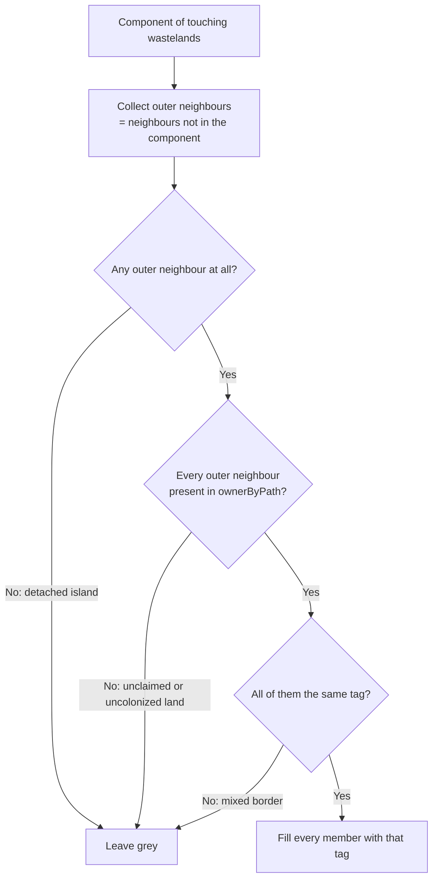

# feat: Fill wastelands only when one country encloses them

## Summary

Paint a wasteland in a country's colour only when that country owns *every* land neighbour of it — or of the whole contiguous wasteland chain it belongs to. Anything less (a second owner on the border, a single unowned neighbour) leaves it grey. This replaces the plurality-vote-with-tie-blending rule prototyped on `feat/subject-hatching`, which is being scrapped. The parser half of that branch — deriving which locations are uninhabitable from the shape of their database entry — is still correct and gets ported; the voting, the tie-blend pattern and the export-time resolution do not.

---

## Problem Frame

Wastelands are unowned by definition, so they never appear in any country's location list and render as grey holes inside otherwise-contiguous territory. The map reads as moth-eaten. The first attempt at closing those holes let the surrounding countries vote — a plurality claimed the wasteland, a tie produced a banded blend — which fills nearly everything (1,614 of 1,895 wasteland shapes on MP_BOH_1644) but invents ownership the save never asserted: a desert with three French neighbours and two Castilian ones becomes French because it was outvoted, not because anyone holds it.

The conservative reading is the defensible one. When a single country owns the entire land border of a wasteland, painting it that colour states nothing the map does not already show — the shape is an enclave inside that country, and leaving it grey is the artifact. When the border is mixed, or any of it is unclaimed, the honest answer is grey.

---

## Requirements

- R1. A wasteland is painted in a country's colour only when that country owns every land neighbour of it.
- R2. A neighbour owned by a different country, or any unowned land neighbour (uncolonized native land, unclaimed frontier), leaves it unpainted. The sea does not disqualify: the asset holds land paths only, so a coastal wasteland simply has fewer neighbours.
- R3. Contiguous wastelands resolve as one unit over their combined outer border — a chain fills entirely or not at all, so no chain interior is left hollow and no two touching wastelands take different colours.
- R4. View-time only: `config.groups`, the legend counts and the downloaded MapChart JSON are byte-identical whether the fill is on or off.
- R5. A `Fill wastelands` toggle in the map toolbar, on by default, applies to the loaded map instantly — no re-parse, no re-export.
- R6. A filled wasteland counts as its country's territory for border and coastline extraction, so the country outline wraps the enclave rather than breaking at it.
- R7. A filled wasteland is painted exactly as the enclosing country's own locations are: its flat colour, its colour override, or the subject hatch when the enclosing country is a subject. A country that is not painted at all (an AI while `playersOnly` is on) fills nothing.
- R8. Toggling the fill, restyling, or dragging the outline width must not re-run border geometry extraction, which costs ~1.3 s on a large multiplayer save.

---

## Scope Boundaries

- No plurality, majority or vote of any kind. A mixed border is a grey wasteland.
- No tie blending, no contested-wasteland pattern. Ties cannot arise under this rule, so the banded `ensureBlend` pattern from the scrapped branch is not ported.
- Wastelands never enter `config.groups`. The exported MapChart JSON stays exactly as it is today.
- The melted-text parser does not classify wastelands. It reports an empty list and the fill is silently off for text saves — the correct degraded behaviour, not a bug to fix here.
- No change to what counts as uninhabitable. The classification ported in U1 is taken as-is.
- Not merging `feat/subject-hatching`. One commit is ported; the rest of that branch stays unmerged.

### Deferred to Follow-Up Work

- Deleting the stale `feat/subject-hatching` branch and its scrapped fill commits: separate housekeeping, once this lands.
- `src/components/OptionsBar.tsx` is dead code — nothing imports it but its own test, and `src/App.tsx` carries the same markup inline. Noted while surveying the toggle surfaces; deleting one of the two is its own change.

---

## Context & Research

### Relevant Code and Patterns

- `src/lib/border-rule.ts` — `buildOwnership` already produces `ownerByPath: Map<pathId, tag>` across **every** country (deliberately not filtered by `playersOnly`) plus `playerTags`. This is precisely the ownership view the enclosure test needs; a second owner index would duplicate it.
- `src/lib/location-adjacency.ts` — memoised, code-split loader for the 718 KB neighbour graph, keyed positionally against `src/lib/location-ids.json`. `src/components/MapTab.tsx` already fetches it whenever `outlineWidth > 0` (the default 0.3), so the fill adds no new asset cost.
- `src/lib/location-resolve.ts` — the only correct path from a save's lowercase name to a canonical `Title_Case` path id; wasteland names must go through it like every other name.
- `src/components/MapRenderer.tsx` — Effect B recolors live nodes and must stay idempotent over `fill`, the inline `style` attribute, `data-hatch-base` and the border layer. Its border-geometry cache (`borderCacheRef`) keys on the **identity** of the ownership object, the graph and the id list.
- `src/lib/__tests__/border-rule.test.ts` — the fixture pattern for graph-shaped pure modules: a named five-location chain, a hand-built `AdjacencyGraph`, and an injected `buildLocationIndex(IDS)`. U2's tests should mirror it.
- `diagnostics/` (gitignored) — standalone Node scripts that load `MP_BOH_1644.eu5` from the project root. `diag-wasteland.mjs` and `diag-wasteland-probe.mjs` already exist from the first attempt and are the template for the measurement in U2's verification.

### Prior Art in This Repo

Six commits on the local `feat/subject-hatching` branch built the scrapped version:

| Commit | What it did | Fate |
|---|---|---|
| `0f78d34` | Parser: derive uninhabitable locations from entry shape | **Ported as-is** (U1) |
| `9c54763` | `wasteland-fill.ts`: plurality vote over component borders | Scrapped; U2 reuses only the component flood fill |
| `52d9c52` | Export-time resolution, `adjacency` on `ExportOptions` | Scrapped; U3 takes a narrower shape |
| `9f4876e` | Renderer: flat fill + banded blend for ties | Partly reused (flat fill only, U5) |
| `5b74936` | `Fill wastelands` toggle in the pre-load options bar | Re-sited to the map toolbar (U4) |
| `7cc496f` | Docs | Rewritten (U6) |

Measured on that branch and worth carrying forward as ground truth: **1,895** uninhabitable shapes on both MP_BOH_1644 and MP_SCO_1453 — 191 years and 5,414 owned locations apart, as static map topology should be. The plurality rule painted 1,614 of them (1,094 with `playersOnly` on). The strict rule will paint far fewer; how many is an open question (see below).

---

## Key Technical Decisions

- **Resolve the fill at the view layer (`MapTab`), not in `export.ts`**: R5 wants the toggle to apply instantly, and R6 wants the result to reach border extraction. Both inputs — `borderOwnership` and the adjacency graph — already meet in `MapTab`, and the graph is already loaded there. Computing it in `export.ts` (as the scrapped branch did) would mean re-running the whole parse-and-export to flip a checkbox, which is exactly why that branch's toggle only took effect on the next file load.
- **Read ownership from `BorderOwnership.ownerByPath`, not from `config.groups`**: the config is filtered by `playersOnly`, so an AI neighbour would read as *unowned* and a wasteland wedged between France and a hidden Castile would wrongly fill French. Same reasoning that already forces the border layer to take ownership from the save rather than the config.
- **Build `borderOwnership` unconditionally** — drop the `hasPlayers ?` gate in `exportMapChartConfig`. It exists because borders are a player feature, but the enclosure test needs ownership in a playerless save too. Border and coastline drawing already gate independently on `playerTags.size`, so nothing else changes.
- **Resolve wasteland names to canonical ids in `export.ts`** (`MapExport.wastelandPaths`), keeping every save-name-to-path-id conversion inside `lib` and letting the view layer work purely in id space.
- **Evaluate connected components, not single locations**: a chain member's neighbours are mostly other wastelands. Per-location evaluation would leave every chain interior unfillable (no owned neighbour at all) and would let two touching wastelands take different colours. Flood fill over wasteland-to-wasteland edges, then test the component's combined outer border — iterative, since chains run to dozens of members.
- **Memoise both the fills map and the augmented ownership object**: `MapRenderer`'s border cache compares ownership by identity, so a freshly built object on every render would re-extract ~1.3 s of geometry per render (R8). Same hazard the fit effect already guards against by comparing `playerPaths` contents rather than identity.
- **Reuse the fill string the group pass computed** for the owning tag — the flat hex, or the `url(#hatch-…)` reference plus its `data-hatch-base` — rather than re-deriving a colour from the tag. Colour overrides, subject hatching and `playersOnly` invisibility then all carry through by construction (R7).
- **Put the toggle in the map toolbar, beside Style and Outline Width**, not in the pre-load options bar. `src/App.tsx` renders that bar only while `status !== "done"`, so a checkbox there unmounts the moment a map exists and could never satisfy R5.

---

## Open Questions

### Resolved During Planning

- What counts as "completely surrounded"?: Every land neighbour owned by one tag. A different owner or any unowned land disqualifies; the sea does not.
- Toggle or always-on?: A `Fill wastelands` toggle, on by default, applying instantly.
- Does a filled wasteland belong to the outline?: Yes — it joins border ownership, so a coastal enclave's coast is stroked instead of leaving a gap in the surrounding country's outline.

### Deferred to Implementation

- **How many wastelands actually qualify** on MP_BOH_1644 and MP_SCO_1453. The plurality rule painted 1,614 of 1,895; the strict rule paints some unknown fraction of that. Measurable only once the rule exists — a diagnostic in U2's verification. If the count comes back near zero the rule is technically correct and practically useless, and that is worth raising before building the UI on top of it.
- Whether a filled coastal enclave's stroked coastline reads well at the default 0.3 outline width. Needs the running app against a real save.
- Exact helper names inside `wasteland-rule.ts`.

---

## High-Level Technical Design

> *This illustrates the intended approach and is directional guidance for review, not implementation specification. The implementing agent should treat it as context, not code to reproduce.*

Pipeline, with the new pieces marked `*`:

```
.eu5 ─► parseBinarySave ─► ParsedSave.uninhabitableLocations *
                                   │
        exportMapChartConfig ──────┼─► MapExport.wastelandPaths *   (names → canonical ids)
                                   └─► MapExport.borderOwnership    (now unconditional *)

MapTab ─ loadAdjacency() ─┐
         wastelandPaths ──┼─► enclosedWastelands() * ─► Map<pathId, tag>
         borderOwnership ─┘            │
                                       ├─► MapRenderer  wastelandFills *  (paint)
                                       └─► ownership ⊕ fills * ─► MapRenderer (border + coast)
```

The decision for one connected component:



---

## Implementation Units

- U1. **Port uninhabitable-location detection from the scrapped branch**

**Goal:** `ParsedSave` carries the names of locations that are neither owned nor populated, derived from the shape of each location's database entry.

**Requirements:** R1 (supplies the input the rule runs on)

**Dependencies:** None

**Files:**
- Modify: `src/lib/binary/sections/locations.ts`
- Modify: `src/lib/binary/parse-binary-save.ts`
- Modify: `src/lib/save-parser.ts` (text path returns `[]`)
- Modify: `src/lib/types.ts` (`ParsedSave.uninhabitableLocations`)
- Test: `src/lib/binary/__tests__/sections.test.ts`

**Approach:**
- Take commit `0f78d34` from the local `feat/subject-hatching` branch essentially unchanged. Both files it touches are byte-identical on `main` to that commit's parent, so it ports without conflict. The 86 lines of tests it added come with it.
- The signal: saves carry no wasteland flag, and names are useless (`Alaska_Range`, `Kyzylkum_Desert` carry no marker substring). A habitable location's entry carries `population` alongside culture and religion; an uninhabitable one carries only `ub` plus the occasional `winter` or `institutions`. Classified uninhabitable when unowned **and** no depth-1 `population` field.
- The depth-1 restriction is load-bearing: `population` also appears inside nested market blocks, where it describes the market, and counting those marks real wastelands habitable.
- Names, not ids, so they resolve through `location-resolve.ts` like every other location name. Names are keyed by location id — never reintroduce a `- 1` at the call site.

**Patterns to follow:**
- `src/lib/binary/sections/locations.ts` — accumulate into a `Set<number>` passed down through `readLocationOwnership` → `readLocationEntries` → `readLocationEntry`, defaulted so existing callers are unaffected.

**Test scenarios:**
- Happy path: an entry with neither an owner nor a depth-1 `population` → classified uninhabitable.
- Happy path: an entry with an owner → not uninhabitable, even with no population.
- Edge case: an unowned entry with a depth-1 `population` (uncolonized native land) → not uninhabitable.
- Edge case: an unowned entry whose only `population` sits inside a nested `market` block → still uninhabitable (the depth guard).
- Edge case: the accumulating set is optional — callers that omit it still read ownership and RGOs correctly.
- Integration: `parseBinarySave` surfaces the names, not the ids, and each name is the one keyed by that location's id.

**Verification:**
- A real save parses to a non-empty `uninhabitableLocations`, and the count matches across both sample saves (1,895 shaped entries once unresolvable names are dropped downstream — the branch measured this on MP_BOH_1644 and MP_SCO_1453 alike).

---

- U2. **The enclosure rule**

**Goal:** A pure module that answers, for a set of wasteland path ids, which of them a single country completely encloses.

**Requirements:** R1, R2, R3

**Dependencies:** None (pure; can be written and tested before U1 or U3 land)

**Files:**
- Create: `src/lib/wasteland-rule.ts`
- Test: `src/lib/__tests__/wasteland-rule.test.ts`

**Approach:**
- One exported entry point taking wasteland path ids, `ownerByPath` (from `BorderOwnership`), the `AdjacencyGraph` and the id list; returning `ReadonlyMap<pathId, tag>` holding only the enclosed ones. Overridable id list so tests inject a small one, as `border-rule.ts` does.
- Ids → graph positions first; the graph is keyed positionally against `location-ids.json`. An id the graph does not cover is skipped rather than throwing.
- Flood fill over wasteland-to-wasteland edges, iteratively (chains run to dozens of members).
- Per component: walk every member's neighbours, skip members, dedupe the rest. An outer neighbour missing from `ownerByPath` means unowned land — reject the component. Two distinct owners — reject. Zero outer neighbours (a detached island shape such as `Amrum_Island_Wasteland`, which the adjacency generator correctly gives no neighbours) — reject, since nothing encloses it.
- Exported in pieces (components, outer border, the enclosure test) so each is independently testable, in the shape `border-rule.ts` uses.
- Functional discipline throughout: `const`, no null, an `else` on every `if`, no exceptions.

**Execution note:** Write this test-first. The rule is entirely decidable from a hand-drawn five-to-eight node graph, and every disqualifying case is cheaper to pin as a failing test than to reason about in place.

**Patterns to follow:**
- `src/lib/__tests__/border-rule.test.ts` — named locations, a literal `AdjacencyGraph`, `buildLocationIndex(IDS)`.
- `wastelandComponents` from `feat/subject-hatching`'s `src/lib/wasteland-fill.ts` (commit `9c54763`) is the one piece of that module worth carrying over; the vote around it is not.

**Test scenarios:**
- Happy path: a wasteland whose three neighbours are all `FRA` → filled `FRA`.
- Happy path: a single neighbour, `FRA` → filled `FRA` (an enclave with one border is still an enclave).
- Happy path: two touching wastelands whose combined outer border is all `FRA` → both filled `FRA`.
- Edge case: a chain of three where the middle member has only wasteland neighbours → all three filled, interior included (the reason components exist).
- Edge case: neighbours `FRA` and `SPA` → not filled.
- Edge case: a chain where one member touches `SPA` and the rest touch only `FRA` → the whole chain unfilled; no partial fill.
- Edge case: neighbours `FRA` and one location absent from `ownerByPath` (uncolonized) → not filled.
- Edge case: a wasteland with no neighbours at all → not filled.
- Edge case: a coastal wasteland — modelled as one with fewer neighbours, all `FRA` → filled `FRA` (the sea is not a neighbour and must not disqualify).
- Edge case: a wasteland id absent from the id list or the graph → skipped, no throw, other components unaffected.
- Edge case: empty wasteland list, empty graph, or empty ownership → empty result.
- Edge case: a wasteland id that also appears in `ownerByPath` (contradictory input) → deterministic and non-throwing; document which way it falls.

**Verification:**
- A throwaway script in `diagnostics/` reports, for MP_BOH_1644 and MP_SCO_1453, how many of the 1,895 wasteland shapes the rule fills and the largest filled chain. Compare against the plurality rule's 1,614 and report the number — it is the first real evidence of whether the rule is useful, and it belongs in the PR description.

---

- U3. **Carry wasteland path ids through the export**

**Goal:** `MapExport` hands the view layer the canonical path ids of every wasteland, and ownership is available even in a playerless save.

**Requirements:** R1, R4

**Dependencies:** U1

**Files:**
- Modify: `src/lib/export.ts`
- Modify: `src/lib/types.ts` (`MapExport.wastelandPaths`)
- Test: `src/lib/__tests__/export.test.ts`

**Approach:**
- Resolve `parsed.uninhabitableLocations` through `location-resolve.ts` into a flat `readonly string[]` of canonical ids. Names with no shape — sea zones and lakes, which are also unowned and unpopulated and so classify as uninhabitable upstream — drop out here exactly as owned names do.
- Additive only: nothing touches `config.groups`, the labels, the colours or the group paths (R4).
- Drop the `hasPlayers ?` gate on `borderOwnership` so it is always built. `qualifyingPairs` and `coastalLocations` already return empty when `playerTags` is empty, so no border behaviour changes.

**Patterns to follow:**
- `collectPlayerPaths` in `src/lib/export.ts` — the established shape for a view-time-only field riding alongside `config`.

**Test scenarios:**
- Happy path: a lowercase wasteland name resolves to its `Title_Case` canonical id in `wastelandPaths`.
- Edge case: a wasteland name with no shape on the map is dropped, not passed through.
- Edge case: a save with an empty `uninhabitableLocations` yields an empty array, not undefined.
- Integration: `JSON.stringify(config)` is identical for the same save with and without `uninhabitableLocations` populated — the R4 guarantee, asserted directly.
- Integration: a save with no players still yields a populated `borderOwnership.ownerByPath`, while `qualifyingPairs` over it stays empty.

**Verification:**
- The exported MapChart JSON for a real save is byte-for-byte what it is on `main` today.

---

- U4. **Wire the toggle, the rule and the augmented ownership into `MapTab`**

**Goal:** A `Fill wastelands` toggle that resolves fills instantly and feeds both the paint layer and the outline layer.

**Requirements:** R5, R6, R8

**Dependencies:** U2, U3

**Files:**
- Modify: `src/components/MapTab.tsx`
- Modify: `src/App.tsx` (pass `wastelandPaths` through `DebugData`)
- Test: `src/components/__tests__/MapTab.test.tsx`

**Approach:**
- Toggle state lives in `MapTab`, defaulting to on, rendered in the toolbar style row beside Outline Width. Not in `src/App.tsx`'s options bar: that bar unmounts at `status === "done"`.
- Broaden the adjacency fetch condition from "borders wanted" to "borders wanted **or** fill wanted", so a user who drags the outline width to 0 still gets fills.
- One memo computes the fills from `wastelandPaths`, `borderOwnership`, `adjacency`, the id list and the toggle; a second builds the augmented `BorderOwnership` — `ownerByPath` extended with each filled wasteland's tag, `playerTags` untouched. When the toggle is off, pass the original object straight through.
- Both memos must be genuinely stable across unrelated re-renders (a colour override, a style change). `MapRenderer` compares the ownership object by identity to decide whether to re-extract ~1.3 s of border geometry.
- Augmenting ownership cannot create a border: every neighbour of a filled wasteland is owned by the same tag by construction, so `qualifyingPairs` finds no new pair. It can only add coastline, which is the point of R6.

**Patterns to follow:**
- The existing `bordersWanted` effect in `src/components/MapTab.tsx` for the conditional chunk fetch.
- `NO_PATHS` in `src/components/MapTab.tsx` — the stable-empty-default idiom that keeps identity-keyed effects from thrashing.

**Test scenarios:**
- Happy path: the toggle renders in the toolbar and is checked by default.
- Happy path: with the toggle on and an enclosed wasteland in the fixture, that path carries the enclosing country's fill in the rendered SVG.
- Happy path: unchecking returns the path to the default fill and leaves every owned path untouched.
- Edge case: outline width dragged to 0 with the toggle on still fetches the adjacency chunk (assert the loader is called).
- Edge case: the toggle on with `adjacency` not yet resolved paints nothing and does not throw.
- Edge case: a colour-override change re-renders without producing a new ownership object identity (pins R8 — assert via a spy on the child's props, or by counting extractions).
- Integration: `Download Config` output is unchanged with the toggle on and off.

**Verification:**
- Flipping the toggle on a loaded save repaints immediately, with no parse and no visible stall; the border layer redraws without a second extraction pass.

---

- U5. **Paint the enclosed wastelands**

**Goal:** `MapRenderer` fills each enclosed wasteland with exactly what its enclosing country is painted.

**Requirements:** R7, R4

**Dependencies:** U4

**Files:**
- Modify: `src/components/MapRenderer.tsx`
- Test: `src/components/__tests__/MapRenderer.test.tsx`

**Approach:**
- New optional prop: wasteland path id → owning tag, defaulted to a stable empty object.
- During the group pass, record the fill each tag resolved to — the flat hex or the `url(#hatch-…)` reference together with its `data-hatch-base`. Then the wasteland pass is a lookup, not a second colour derivation, so overrides and subject hatching carry through for free (R7).
- Resolving a tag to a paint entry: the tag's own group row first; failing that, and only when the tag is a subject of a painted overlord, the overlord's `TAG - subjects` overlay row. Failing both — an AI hidden by `playersOnly` — leave the shape at the default fill.
- Apply after the group pass but **skip any path the group pass already painted**, so real ownership always wins a collision. (The rule cannot produce one — uninhabitable requires unowned — but the guard is free and the invariant is worth stating.)
- Everything written here must be cleared by the existing reset: `fill`, the inline `style` attribute, `data-hatch-base` and the regenerated `defs`. The stroke pass that follows already derives each path's stroke from its fill, so a filled wasteland picks up the matching stroke with no extra work.
- No blend pattern, no second `defs` entry type. Ties cannot occur.

**Patterns to follow:**
- The existing hatch resolution in Effect B of `src/components/MapRenderer.tsx` (`hexByTag`, `overlordHexFor`, `ensureHatch`).
- Commit `9f4876e`'s flat-fill branch on `feat/subject-hatching` — the single-claimant half of it only.

**Test scenarios:**
- Happy path: a wasteland whose tag has a group takes that group's hex.
- Happy path: a colour override on the enclosing country moves the wasteland's fill with it.
- Edge case: a wasteland whose tag has no group (AI hidden by `playersOnly`) stays at the default fill.
- Edge case: a wasteland enclosed by a subject's territory takes the same hatch fill as that subject's own paths and carries `data-hatch-base` for the stroke pass.
- Edge case: a wasteland id with no shape in the asset is counted as a miss and does not throw.
- Edge case: a path named by both a group and the fill map keeps the group's colour.
- Edge case: four consecutive recolors leave one hatch pattern definition, one border layer, and no accumulated DOM (idempotency, as the existing suite already pins).
- Edge case: re-rendering with an empty fill map returns previously filled paths to the default fill.

**Verification:**
- On a real save, enclaves inside a player's territory read as solid colour with the country outline running around the outside of them; nothing inside a country's interior is stroked.

---

- U6. **Record the rule**

**Goal:** `CLAUDE.md` states the rule and its non-obvious constraints so the next change does not relitigate them.

**Requirements:** R1, R2, R3, R6

**Dependencies:** U5

**Files:**
- Modify: `CLAUDE.md`
- Modify: `README.md` (the "5,863 unmatched names" note now has a second consumer)

**Approach:**
- Add to Architecture: uninhabitable detection → `wasteland-rule.ts` → view-layer fills → augmented ownership.
- Add to Conventions: the fill is view-time only; `config.groups` and the exported JSON never change.
- Add to Gotchas, the three that will otherwise be rediscovered the hard way:
  - Ownership for the enclosure test comes from `ParsedSave`/`borderOwnership`, not `config.groups` — a `playersOnly`-hidden AI neighbour would otherwise read as unowned and fill a wasteland that is not enclosed at all.
  - The rule is component-wise because a chain member's neighbours are mostly other wastelands; per-location evaluation leaves chain interiors hollow.
  - The fills map and the augmented ownership must be memoised: `MapRenderer` keys its border cache on ownership identity, and a fresh object per render costs ~1.3 s of re-extraction each time.
- Correct any lingering claim that wastelands are simply "dropped" — they are still dropped from `config.groups`, but they are now painted.

**Test scenarios:** Test expectation: none — documentation only.

**Verification:**
- A reader who knows nothing of this plan can infer, from `CLAUDE.md` alone, why a mixed-border wasteland stays grey and why the fill never touches the export.

---

## System-Wide Impact

- **Interaction graph:** `MapTab`'s adjacency fetch now has two callers (borders, fills); `MapRenderer` gains one prop and one consumer of the ownership object it already receives.
- **Error propagation:** every failure mode degrades to "no fills" — a text save, a failed adjacency chunk (the loader already resolves to an empty graph), an unresolvable name, a tag with no painted group. Nothing throws, matching the module conventions.
- **State lifecycle risks:** the recolor pass must stay idempotent; the border cache must not be invalidated by a new-but-equivalent ownership object.
- **API surface parity:** `MapExport` gains a field; `ParsedSave` gains a field. Both are internal. The MapChart JSON — the only externally-consumed artifact — is unchanged by design and asserted so.
- **Integration coverage:** the config-identity assertion (U3) and the ownership-stability assertion (U4) are the two that unit tests of the rule alone would never prove.
- **Unchanged invariants:** `config.groups` membership, legend counts, `paths.length` per group, the downloaded MapChart JSON, the framed opening view and the PNG crop region. A filled wasteland is not in `playerPaths`, so the frame does not move.

---

## Risks & Dependencies

| Risk | Mitigation |
|------|------------|
| The rule is so strict that almost nothing fills, and the feature is pointless | Measure it before building the UI — U2's verification reports the count on both sample saves. Raise it if the number is tiny. |
| A freshly-built ownership object per render silently re-extracts ~1.3 s of border geometry | Memoise both derived values; assert identity stability in `MapTab`'s tests (R8). |
| Augmented ownership changes where borders fall | Impossible by construction — every neighbour of a filled wasteland shares its tag — and the existing border suite stays green as the check. |
| The uninhabitable classification is a heuristic over entry shape, not a save flag | It is measured stable at 1,895 across two saves 191 years apart; ported unchanged rather than re-derived, and a wrong classification costs a fill, not a crash. |
| jsdom has no `getBBox` and no layout, so component tests can silently exercise fallbacks | Stub deliberately and assert both paths, as the existing `MapRenderer`/`MapTab` suites already do. |

---

## Documentation / Operational Notes

- No migration, no persistence, no rollout concern: the feature is a checkbox over data already in memory.
- Bundle size is unchanged — the adjacency chunk already loads by default for borders.
- Worth a screenshot pair (fill on / off, framed on a player with real enclaves) in the PR description, alongside the qualifying-wasteland counts from U2.

---

## Sources & References

- Scrapped prototype: local branch `feat/subject-hatching`, commits `0f78d34`, `9c54763`, `52d9c52`, `9f4876e`, `5b74936`, `7cc496f` (unmerged; `origin/feat/subject-hatching` sits at `6d62aca`, before them)
- Related plans: `docs/plans/2026-09-14-002-feat-player-border-outlines-plan.md` (the adjacency graph and border layer this builds on), `docs/plans/2026-09-12-001-feat-location-based-map-filling-plan.md` (name resolution and the drop-at-config-build rule)
- Related code: `src/lib/border-rule.ts`, `src/lib/location-adjacency.ts`, `src/lib/location-resolve.ts`, `src/components/MapRenderer.tsx`
- Related PRs: #16 (merged `feat/subject-hatching` at `6d62aca`, before the wasteland commits), #18, #19, #20, #22
